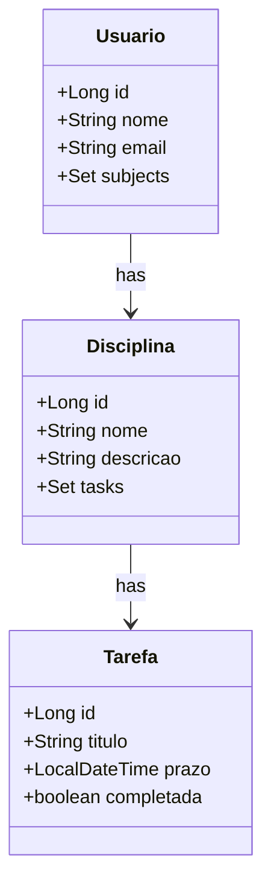

# restudy-api
API Rest desenvolvida para simular uma aplicação direcionada à ajudar os estudantes a organizarem metas de estudo, tasks e progresso

## Diagrama de Classes

```mermaid
classDiagram
    class Usuario {
        +Long id
        +String nome
        +String email
        +Set<Disciplina> subjects
    }

    class Disciplina {
        +Long id
        +String nome
        +String descricao
        +Set<Tarefa> tasks
    }

    class Tarefa {
        +Long id
        +String titulo
        +LocalDateTime prazo
        +boolean completada
    }

    Usuario --> Disciplina : has
    Disciplina --> Tarefa : has
```
